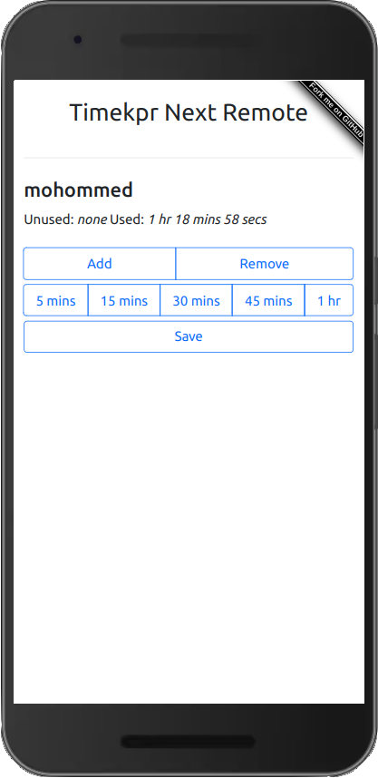

# Timekpr-nExT Remote

A dockerized web app, written in python, for easily adding or removing time for users of [Timekpr-nExT](https://mjasnik.gitlab.io/timekpr-next/). The primary goal is to allow parents to use their phone to easily give more computer time to their child(ren). Works on Desktop or Mobile:


Features:
* Manage at least 1, likely up to 10, accounts
* Run via a docker one liner
* Intuitive web app interface is easy to use from any phone in the house




<details>
<summary> Video - Mobile phone controlling desktop</summary>

In this demo, you can see how a parental phone (foreground) can easily load the web UI and quickly add time to a childs desktop device (background):

https://user-images.githubusercontent.com/8253488/213629663-1de76346-6e79-412a-a368-c1f804c28b35.MP4

</details>

<details>
<summary> Video - Docker start with gracefull error handling</summary>

In this demo, you when some nodes are down, the back end and front end handle this without breaking.  Further, users on two different desktops can easily be controlled from the UI:

https://user-images.githubusercontent.com/8253488/220523348-76c3f5ea-419d-46a7-8aa6-c809d095bfc9.mp4

</details>


## Install

### Prerequisites

* Server that can run docker compose and can SSH to the clients you want to control
* Client device runs linux and has SSH enable
* Client device has Timekpr-nExT installed and configured to have a limited amount of time per day (<24 hrs ;)

### Server

1. clone this repo
2. copy `conf.example.py` to `conf.py`
3. edit `conf.py`:
   * change `ssh_password` to be a good password. This will be the password used to log into all the clients
   * add key value pairs in `trackme` of the clients and IPs you want to manage.  You can use domain names as well.
4. run `docker compose up -d`
5. go to `http://your-server-IP:8080` on your phone or desktop

### Clients

Follow these steps for on each client you want to control:

1. Add a new `timekpr-next-remote` user to each machine you want to manage. 
2. Set the password for  `timekpr-next-remote` to be the same as step 3 above, so it matches the config value of `ssh_password`
3. Add the `timekpr-next-remote` to the `timekpr` group: `sudo gpasswd -a timekpr-next-remote timekpr`
4. Restart to ensure the group change took effect
5. Ensure the user can SSH in using the IP from `trackme`, the `ssh_user`  and the `ssh_password`

## Settings

### `config.py`

* `trackme` - python object to store all the folks you want to manage
* `ssh_user` - user to SSH into client machines as. Defaults to  `timekpr-next-remote`
* `ssh_password` - password to use wen SSHing into client machines. Defaults to  `timekpr-next-remote`
* `ssh_timekpra_bin` - path on clients where `timekpra` executable is. defaults to  `/usr/bin/timekpra`
`ssh_key` - wtf - I don't know, SSH library wouldn't work with out this.  don't touch this

### docker compose

* `TIMEKPR_PORT` - the port that docker compose will expose the service on. Defaults to `8080`
* `TIMEKPR_IP` - the IP that docker compose will bind the web server to.  Good for binding to a private IP that only other docker containers can see (like a reverse proxy!). Defaults to `0.0.0.0`.

## Security

By design, this system is very secure as far as controlling clients over SSH, but is relatively insecure when it comes to browsing to the web app.  Here's some tips to increase security:

* if you want to ensure the SSH user on the server can not do anything more than run `timekpra`, then you can restrict this in [the `authorized_keys` file on each client](https://www.virtono.com/community/tutorial-how-to/restrict-executable-ssh-commands-with-authorized-keys/).
* Run  something like [Traefik](https://github.com/traefik/traefik/) or [Caddy](https://caddyserver.com/) in another docker container.  From there you can bind the timekpr-next remote server to the host docker IP with something like `TIMEKPR_IP=172.17.0.1 docker compose up -d`.  It will no longer be available on the network, only only via the revers proxy you set up.

   You can then either use `basicauth` ([eg in Caddy](https://caddyserver.com/docs/caddyfile/directives/basicauth)) or what I did is make a host name that is unguessable like `https://user-time-8957446623432192758492038.domain.com`.  Everyone just bookmarks this.  Even if your kids see the URL, they won't be able to remember it.


## Todo

* [ ] add PIN protection in web GUI
* [ ] add "refresh" button per client in web GUI
* [ ] support ssh keys
* [X] enable more than one user per machine
* [X] better error handling when SSH fails etc.
* [X] AJAX async loading
* [X] handle identically named users on diff servers

## Related projects

* [timekprw](https://github.com/nvsmirnov/timekprw) - defunct as it dependent on an [appspot page]( https://timekprw.ew.r.appspot.com ) which is dead
* [timekpr-server](https://github.com/frohmut/timekpr-server )- "Sample config server implementations and HTML UI for Timekpr"
* [timekpr](https://github.com/frohmut/timekpr) - "Timekpr-Sync: Timekpr extension to spread user configurations in the home network"
* [timekpr-cli](https://github.com/cisba/timekpr-cli) - "Simple Timekpr CLI" - local python wrapper script)

## Development

Development can be done using locally running [LXD containers](https://canonical.com/blog/lxd-virtual-machines-an-overview). After launching an Ubuntu 22.04 container, SSH is enable by default, but only allows key access, so be sure to add your public keys as needed.  From there `adduser` a new user, then run this to install timekpr:

```
sudo add-apt-repository ppa:mjasnik/ppa
sudo apt-get update
sudo apt-get install timekpr-next x11-apps
```

You can then `ssh -X USER@IP` and then run `timekpra` to configure your test users in timekpr via a GUI.  

During development, it's nice to watch the times for a specific user with `watch -n 1 timekpra --userinfo USERNAME`
